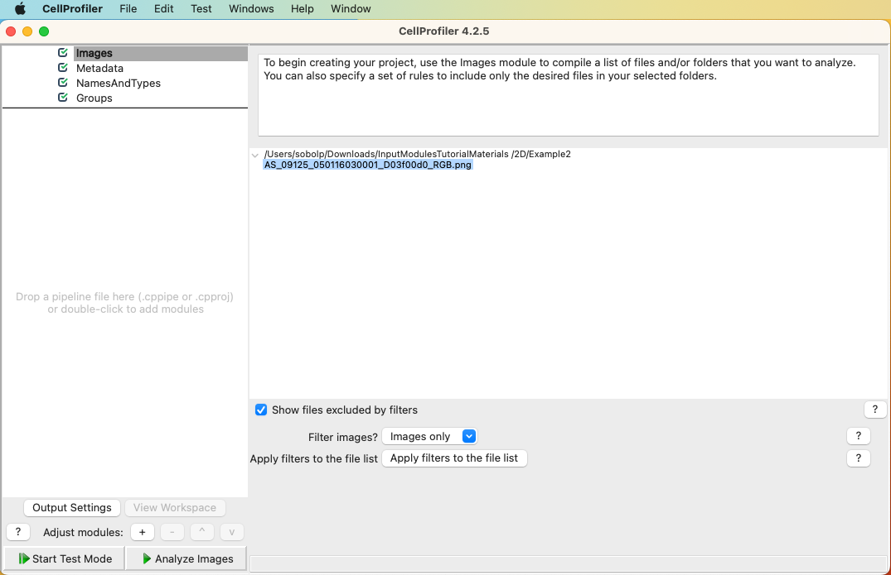
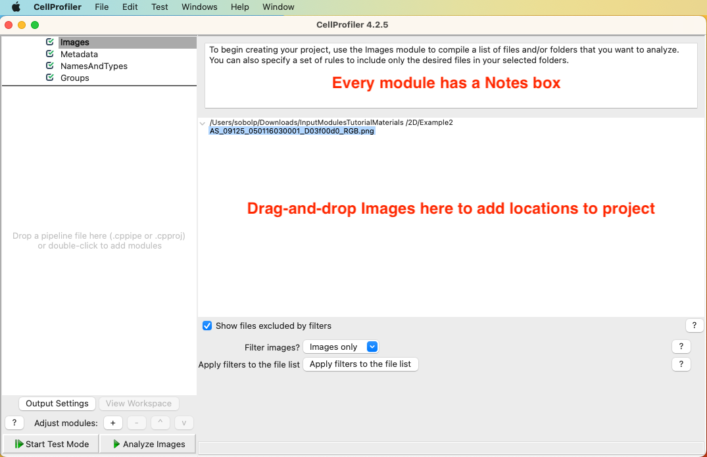
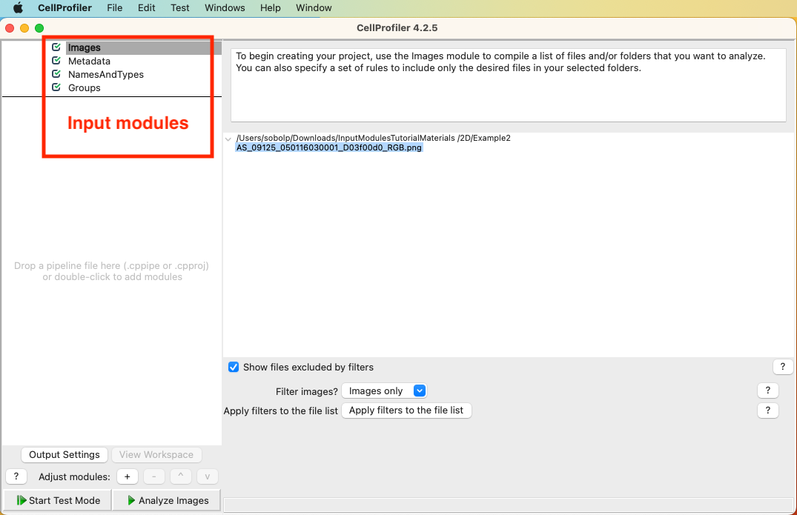
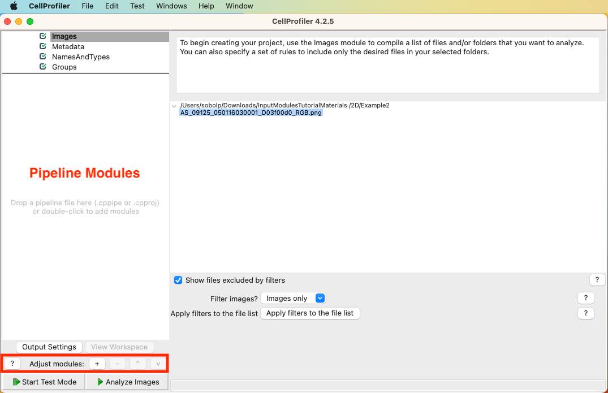
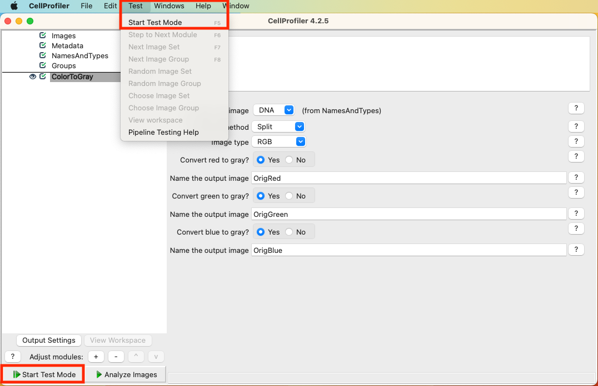
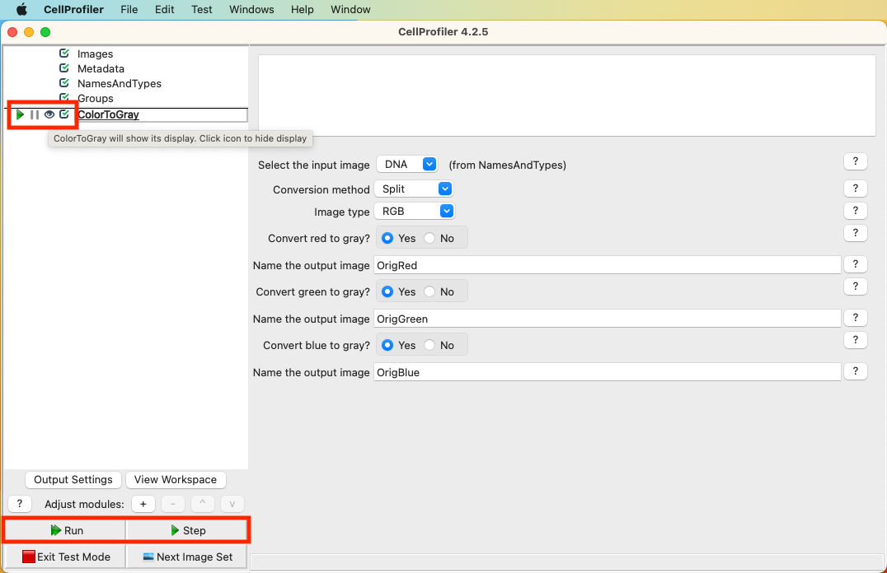
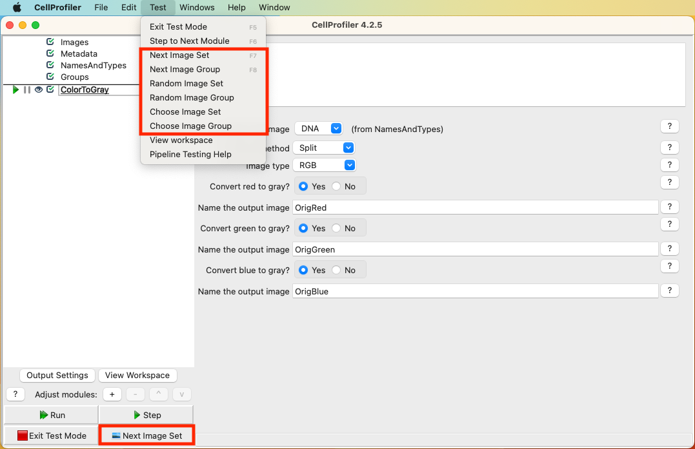
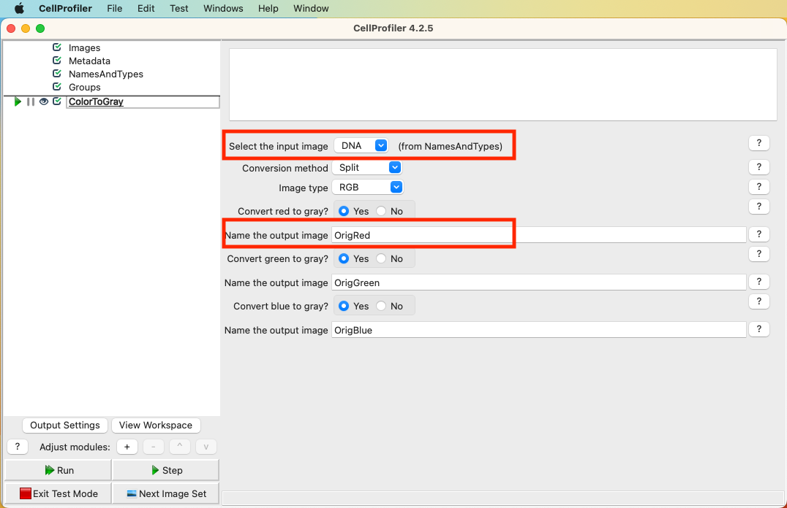
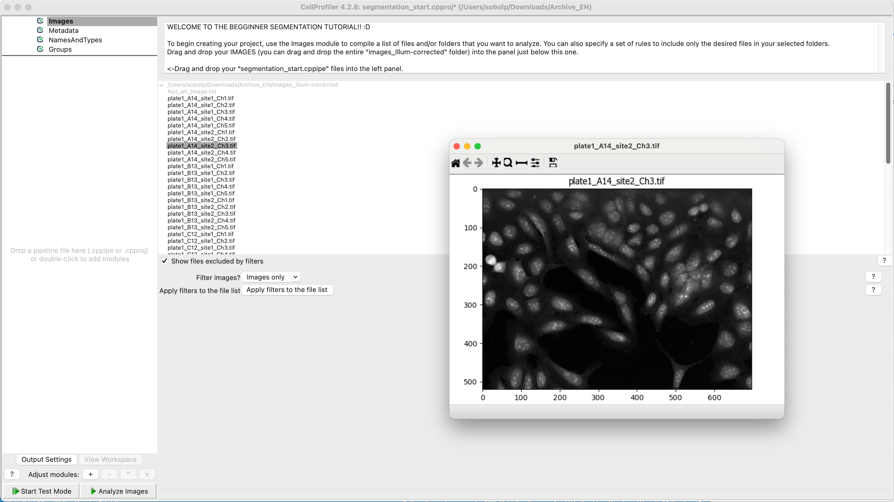

## Introduction to CellProfiler

**Peter Sobolewski (he/him)**

Systems Analyst, Imaging Applications

Research IT

https://cellprofiler.org/home

## Plan

- Introduction to CellProfiler
- Overview of basic CellProfiler concepts
    - projects, pipelines, modules 
- User Interface (UI) Walk-through
- Hands-on [Segmentation Tutorial](https://tutorials.cellprofiler.org/#beginner-segmentation)
- Hands-on [Input Modules Tutorial](https://tutorials.cellprofiler.org/#input-modules)

## What is CellProfiler?

CellProfiler is an open-source image analysis program

 

**Key feature**:  
CellProfiler has a graphical user interface (`GUI`) for assembling image processing and analysis workflows (called `pipelines`) using a sequence of modular analysis `modules` 

## A bit of background

- project started in 2003 by Anne Carpenter and Thouis Jones at MIT
- currently developed by [the Beth Cimini lab](https://cimini-lab.broadinstitute.org/) at the Broad Institute
- \>17000 publications [citing CellProfiler](https://cellprofiler.org/citations)
    - Many shared `pipelines`: [https://cellprofiler.org/published-pipelines](https://cellprofiler.org/published-pipelines)

## Strengths of CellProfiler

- It was designed for batch image analysis using reproducible workflows—*without scripting*

- It *includes* advanced algorithms for image (pre)processing, segmentation, etc. as modular `modules`

- It *includes* in-app documentation for `module` parameters plus extensive help menu

- End-to-end workflows: images go in, data tables go out

## Limitations

- Limited *viewing* capabilities:
    - single planes, single channels only
- No annotation tools
- Limited out-of-memory performance
    - lacking support for multiscale ("pyramidal") images
    - lacking built-in tiling/chunking
- Limited OMERO support
- Problematic OME.TIFF handling

## The CellProfiler concept

- Create a `project` that has an associated image file list of *locations* and an associated `pipeline` 
- Use the GUI to add a sequence of `modules` to implement your analysis—these form a `pipeline`
    - Start with input images and end with measurements in a spreadsheet (`.csv`) or a MySQL database
- run in batches over large number of images
- analyze measurement data in the downstream tool of your choice (Python, R, Excel, etc.)

## CellProfiler `projects` & `pipelines`

- `projects` contain a list of the *locations* of your image files plus an associated CellProfiler analysis `pipeline`
    - `projects` will also contain some cached computed results

 

- `pipelines` can be exported, but *do not contain image locations*—this is ideal for sharing or reuseing workflows

## Typical `pipeline`

- start with setting up `Input` modules
- Add `Image Processing` modules to facillitate segmentation
- Add `Object Processing` modules to segment the image (identify objects) and manipulate objects
- Add `Measurement` modules to get quantified information you're interested in
- Finish with `Data Tools` and `File Processing` to export data or images

# CellProfiler UI

{fig-alt="Screenshot of empty CellProfiler UI with menu bar"}

---

{fig-alt="Screenshot of empty CellProfiler UI with menu bar. At the top right, the Notes box is emphasized with red text. Below, in the middle-right, the Image list drag-and-drop is emphasized with red text."}

---

{fig-alt="Screenshot of empty CellProfiler UI with menu bar. In the top left, the four Input modules are highlighted with a red box and red text."}

---

{fig-alt="Screenshot of empty CellProfiler UI with menu bar. On the middle-left, the area for adding pipeline modules is highlighted with red text. Below, the module buttons are highlighted with a red box."}

---

{fig-alt="Screenshot of CellProfiler UI with menu bar and a single module (ColorToGrey) open. At the top, the Test menu is open and the `Start Test Mode` option is highlighted with a red box. At the bottom left, the `Start Test Mode` button is highlighted with a red box."}

---

{fig-alt="Screenshot of CellProfiler UI with menu bar and a single module (ColorToGrey) open. Test mode is now active. At the top of the modules area, the Test mode buttons next to the ColorToGrey module are highlighted with a red box. At the bottom left, the Run and Step buttons are highlighted with a red box."}

---

{fig-alt="Screenshot of CellProfiler UI with menu bar and a single module (ColorToGrey) open. Test mode is now active. At the top, the Test menu is open and the Image set menu items are highlighted with a red box. At the bottom left, the `Next Image Set` button is highlighted with a red box."}

---

{fig-alt="Screenshot of CellProfiler UI with menu bar and a single module (ColorToGrey) open. In the middle right, the ColorToGrey module options are showing with the input image selection and output image naming highlighted with red boxes."}

# Keys to success

- ensure image inputs are properly set up (`NamesAndTypes`) and that they and intermediate step outputs have meaningful names
- use `Test` mode to see the outputs of individual `modulues` (`pipeline` steps) one-at-a-time
    - let's you test parameters on a single image or any number of images (even a randomly selected one)
    - can run the whole `pipeline` or just individual `modules`  

## Getting more help

- Online manual: [https://cellprofiler.org/manuals](https://cellprofiler.org/manuals)

- Extensive tutorials: [https://tutorials.cellprofiler.org/](https://tutorials.cellprofiler.org/)

- Extensive examples: [https://cellprofiler.org/examples](https://cellprofiler.org/examples)

- Image.sc forum: [https://forum.image.sc/tag/cellprofiler](https://forum.image.sc/tag/cellprofiler)

# Segmentation Tutorial

- Ensure you have the tutorial materials downloaded. If not, download the [`.zip file`](https://github.com/CellProfiler/tutorials/raw/master/BeginnerSegmentation/Archive_EN.zip)
- Inside the folder is a PDF walkthrough, if you want to follow along on your own

## Import the starting pipeline

- Inside the folder are also two `.cppipe` files, which define the CellProfiler pipelines
  - `segmentation_start.cppipe` is our starting point, it handles the initial image importing and set up. 
  - Drag-and-drop it onto the Pipeline Modules section (middle left pane) to import it.

:::{.callout-tip}
The `segmentation_final.cppipe` is the final pipeline, which you can use to see the completed analysis pipeline!
:::

## Import the images

- Import the images by drag-and-dropping the `images_Illum-corrected` folder onto the central image list pane
- Click on `Apply filters to the file list` to filter out non-images

:::{.callout-tip}
Double-click an image in the list to open and view it
:::

## Completed setup

{fig-alt="Screenshot of CellProfiler UI with menu bar and the segmentation_start pipeline imported. The image list is populated with images and an example is open."}

# Input Modules Tutorial

This tutorial will introduce you to Input Modules in CellProfiler: `Images`, `Metadata`, `NamesAndTypes`, and `Groups`. These modules are crucial for loading and organizing your input data so CellProfiler manages it properly in the analysis pipeline.

## Getting started

- Ensure you have the tutorial materials downloaded. We will use a sub of the official CellProfiler [Input Modules Tutorial materials](https://tutorials.cellprofiler.org/#input-modules). You can download the [`.zip file`](resources/InputModulesTutorialMaterials.zip).
- There is a [blog post walkthrough](https://carpenter-singh-lab.broadinstitute.org/blog/input-modules-tutorial) this tutorial if you want to follow along on your own.